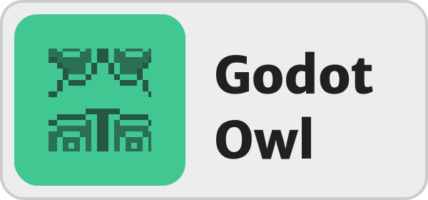

# GodotOwl

GodotOwl is a plugin for Godot 4+ that allows you to track how much time you spend on a project. This plugin displays a timer in the top right corner of the screen that automatically increments.

The timer automatically pauses after 5 minutes if you switch windows or perform no actions.

By pressing the extension, you can display a calendar showing how much time you spent on the project each day.

> To prevent GodotOwl from activating for everyone when you put your code online, you can simply add "addons/godot_owl" to your project's .gitignore.

## Credits

- Icons from Material Symbol & Icons by Google
